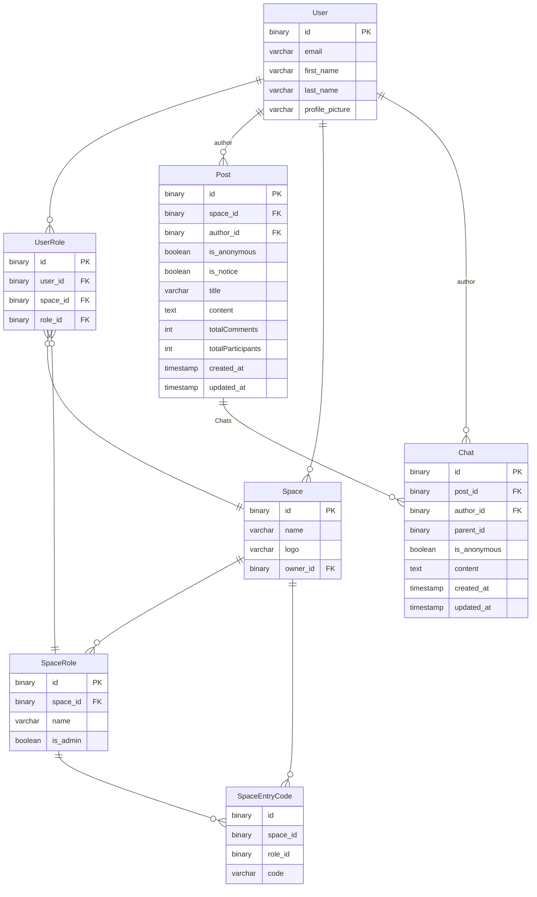

## 온라인 커뮤니티 플랫폼

이 프로젝트는 사용자들이 커뮤니티 공간을 개설하고 관리할 수 있는 온라인 플랫폼입니다. 사용자는 다양한 역할과 권한을 설정하여 구성원들과 소통할 수 있습니다.

## 기술스택

Nestjs Express TypeOrm zod

## 기능

### 유저 프로필 관리

사용자는 자신의 프로필 정보를 관리하며, 이름, 성, 프로필 사진을 수정할 수 있습니다.
각 사용자는 자신이 작성한 게시글과 댓글 목록을 조회할 수 있습니다.

### 공간 관리

사용자는 새로운 공간을 개설하거나 기존 공간에 참여할 수 있습니다.
각 공간은 입장 코드를 통해 접근이 관리되며, 사용자는 관리자 또는 참여자로 참여할 수 있습니다.
공간 소유자는 역할을 관리하고, 공간을 삭제할 수 있는 권한을 갖습니다.

### 게시글 및 댓글

공간 내에서 사용자는 자유롭게 게시글을 등록할 수 있으며, '공지'와 '질문' 두 유형의 게시글을 지원합니다.
익명으로 게시글과 댓글을 작성할 수 있으며, 관리자는 익명 게시글의 작성자를 확인할 수 있습니다.

### 인기 게시글

인기 게시글은 댓글 수와 참여 유저 수에 따라 자동으로 선정됩니다.
각 공간에서 최대 5개의 인기 게시글을 확인할 수 있습니다.

## 실행 순서

1. yarn install
2. docker-compose up -d
3. yarn migration:dev:generate src/database/migrations/dev/First
4. yarn migration:dev:run
5. yarn start:dev 혹은 yarn start:prod
6. src/space-room.postman_collection.json를 import하여 사용

## 테스트

1. yarn test

---

### TODO

1.  댓글 : 생성,수정,삭제 디버깅
2.  domain간의 상호작용 최적화

---

ERD

