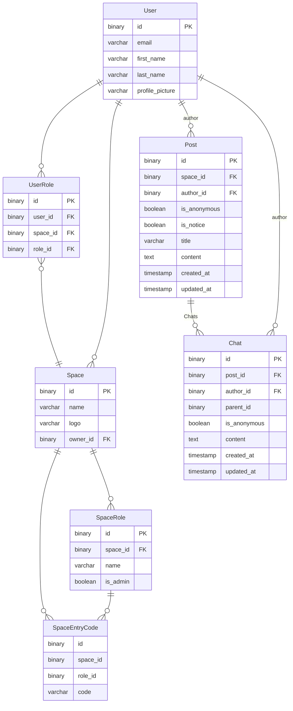

```mermaid
erDiagram
    User ||--o{ UserRole : ""
    UserRole }o--|| Space : ""
    Space ||--o{ SpaceRole : ""
    User ||--o{ Post : "author"
    Post ||--o{ Chat : "Chats"

    User ||--o{ Space : ""
    User ||--o{ Chat : "author"

    Space ||--o{ SpaceEntryCode : ""
    SpaceRole ||--o{ SpaceEntryCode : ""


    User {
        binary id PK
        varchar email
        varchar first_name
        varchar last_name
        varchar profile_picture
    }

    Space {
        binary id PK
        varchar name
        varchar logo
        binary owner_id FK
    }

    SpaceRole {
        binary id PK
        binary space_id FK
        varchar name
        boolean is_admin
    }

    SpaceEntryCode {
        binary id
        binary space_id
        binary role_id
        varchar code
    }

    UserRole {
        binary id PK
        binary user_id FK
        binary space_id FK
        binary role_id FK
    }

    Post {
        binary id PK
        binary space_id FK
        binary author_id FK
        boolean is_anonymous
        boolean is_notice
        varchar title
        text content
        timestamp created_at
        timestamp updated_at
    }

    Chat {
        binary id PK
        binary post_id FK
        binary author_id FK
        binary parent_id
        boolean is_anonymous
        text content
        timestamp created_at
        timestamp updated_at
    }
```
