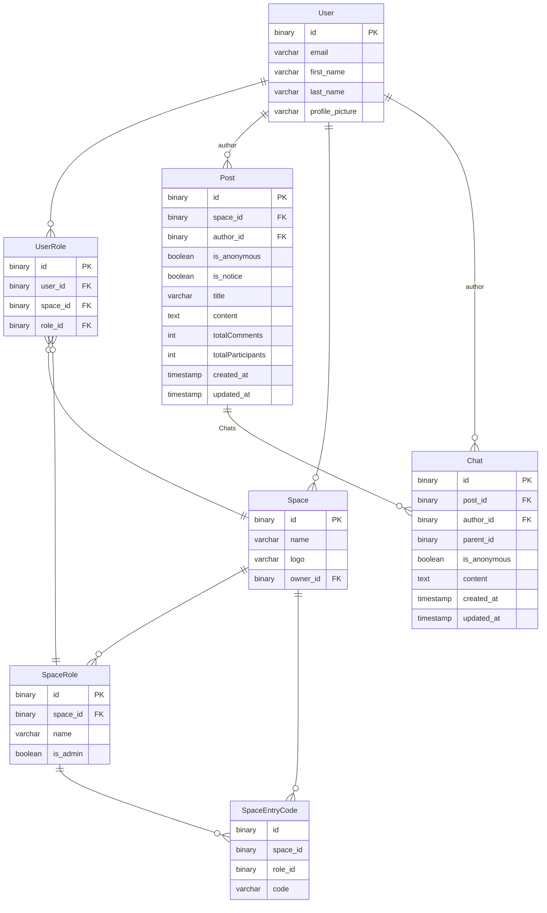

## 실행 순서

1. yarn install
2. docker-compose up -d
3. yarn migration:dev:generate src/database/migrations/dev/First
4. yarn migration:dev:run
5. yarn start:dev 혹은 yarn start:prod
6. src/space-room.postman_collection.json를 import하여 사용

---

### TODO

0.  누락된 usecase, repository, manager에 대한 단위 테스트 추가
1.  댓글 : 생성,수정,삭제 \
    게시글 : 수정 삭제 조회

        위 기능들에 대해 디버깅

2.  누락된 특수경우에 대한 예외처리
3.  domain간의 상호작용 최적화
4.  orm의 join를 활용해 쿼리 수 최적화

---

ERD

